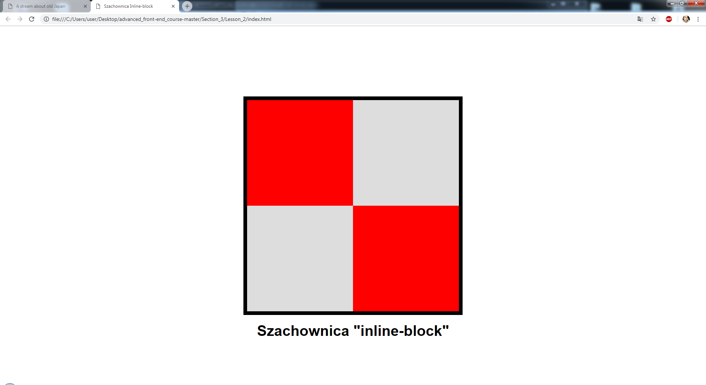
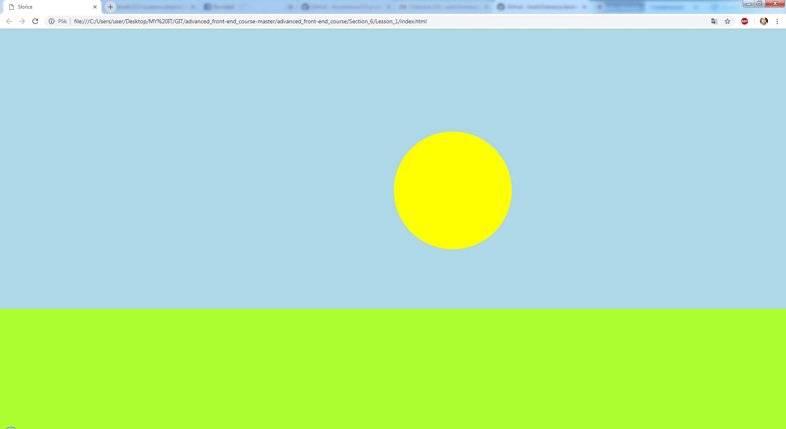
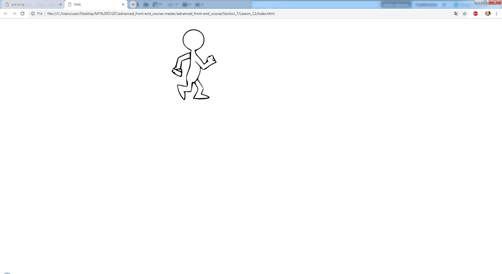
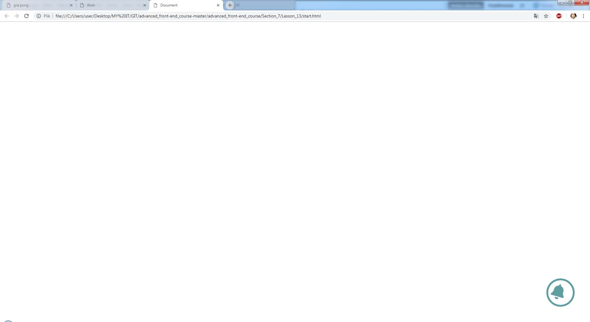
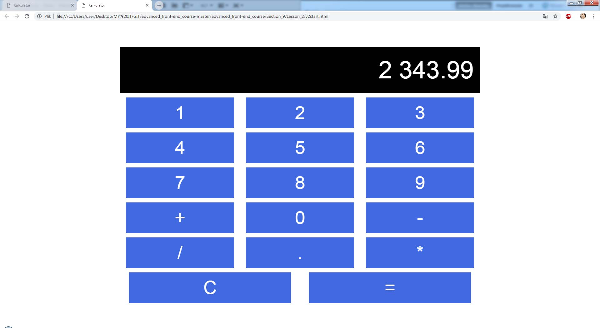
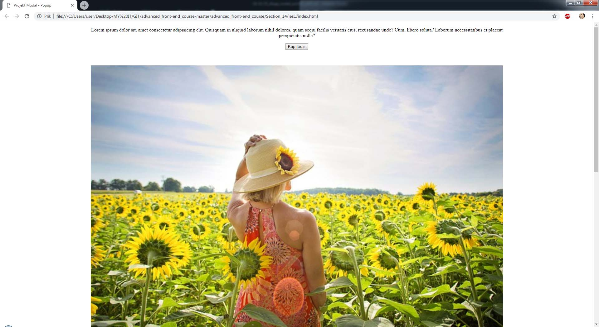
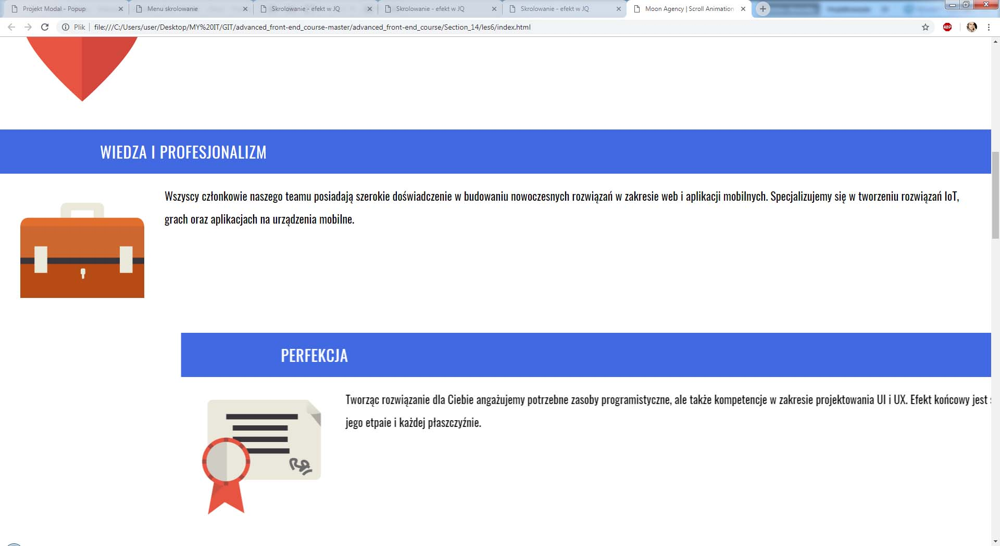
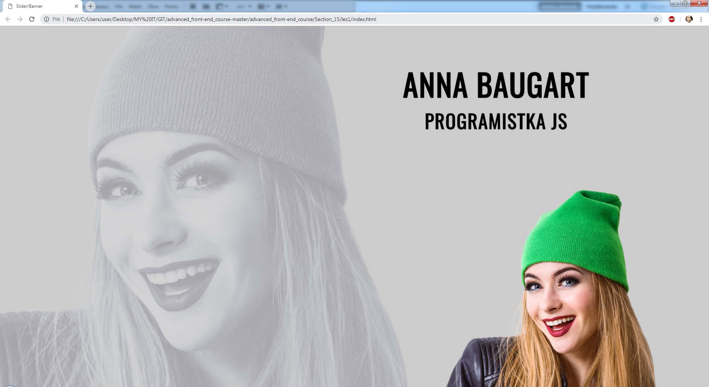
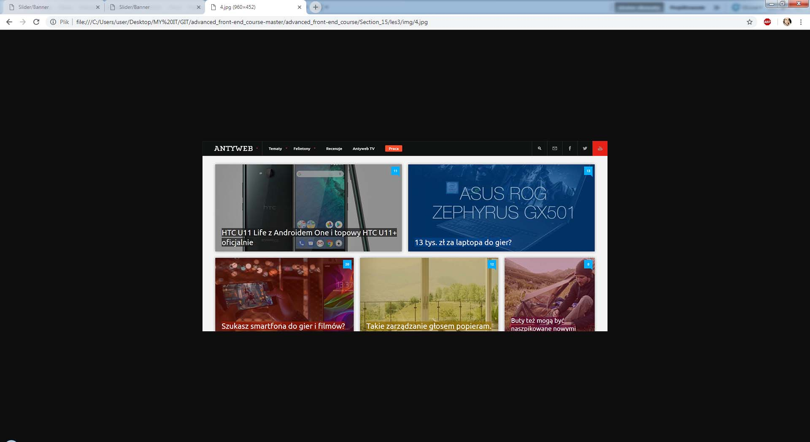
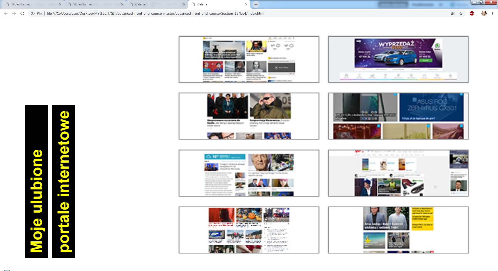

- - -
## Web samurai path.
## [PL: Projekt od podstaw do front-end developera. Ścieżka Samuraj Programowania. Autor kursu - Bartek Borowczyk]

- - -

### 1. Advanced Front-End Course.  :heavy_check_mark:
### [PL: "Front-end zaawansowany w 15 dni".
### Naucz się tworzyć atrakcyjne strony internetowe z wykorzystaniem bardziej zaawansowanych technik CSS i JavaScript.]

- - -

**Section 1. CSS fundamentals. Part 1** :heavy_check_mark:
* Cascading Style Sheets | CSS selectors | Fonts | Units;

**Section 2. CSS fundamentals. Part 2** :heavy_check_mark:
* Backgrounds | Boxmodel | Position | Display | Normalize & reset | Calc | Variables | Header and nav;

**Section 3. Placing elements on a web page** :heavy_check_mark:
* Old Japan Picture challenge

> Screenshot of "Japan"

* Chessdesk with inline block

> Screenshot of "Chessdesk"

* Chessdesk with float | Chessdesk with position | Project with Font Awesome and Media Queries;

**Section 4. Animation with CSS** :heavy_check_mark:
* Transition; Colors challenge; Moving square challenge;

> Screenshot of "Line with square"

* Transform | Centering elements challenge | Moving line challenge | Building a house challenge;

> Screenshot of "House"

**Section 5. Transition and transform** :heavy_check_mark:
* Clock

> Screenshot of "Clock" animation

* Button animation with span
| Button animation with after pseudoselector
| Button animation with color changing
| Button with double animation
| Button with triangle
| Button hover challenge
| Button with click and jQuery;

**Section 6. Animation properties** :heavy_check_mark:
* Project sun

> Screenshot of "Raising sun"

* Button shaking
| Button transition
| Button slide animation challenge
| Button text animation challenge
| Disco challenge;

> Screenshot of "Disco"

* Three dots animation
| Three dots with span animation
| Banner with changing pictures;

> Screenshot of "Changing banner"

> Screenshot of "Banner with text"

**Section 7. Animation projects** :heavy_check_mark:

* Pong animation challenge

> Screenshot of "Pong"

* Walking man animation

> Screenshot of "Moving man"

* Bell animation

> Screenshot of "Bell"

* Arrow animation

**Section 8. Flexbox** :heavy_check_mark:

* Flexbox basics
| Flexbox properties
| Flexbox container
| Flexbox properties practice
| Flexbox model;

**Section 9. Flexbox, CSS Grid and Responsive Web Design** :heavy_check_mark:

* Project calculator with Flexbox

> Screenshot of "Calc"

* Project calculator with spaces beetween

> Screenshot of "Calculator"

* RWD with media queries

> Screenshot of "RWD"

* Galery with Flexbox

> Screenshot of "Galery"

* Flexbox layout
| Layout with flexbox and media queries;

> Screenshot of "Flexbox layout"

* Layout with CSS Grid
| Pricelist with CSS Grid;

> Screenshot of "Pricelist"

**Section 10. JavaScript in web design** :heavy_check_mark:

* JS basics
| Variables
| Types of variables
| JS events;

**Section 11. JavaScript Projects** :heavy_check_mark:

* Working with JS
| Font size changing after click project
| Color change after clicking on div element project
| Rotating square
| Adding square after click project;

**Section 12. jQuery basics** :heavy_check_mark:

* Adding square with button with JQ
| JQ basics
| Practicing JQ;

> Screenshot of "Changing text style with buttons"

* JQ properties and methods for DOM
| BG changing after button click;

**Section 13. Burger menu** :heavy_check_mark:

* Project: Side burger menu with hover 
| Project: Sliding butger menu after click
| Project: Burger icon
| Project: Burger menu with JQ
| Project: Integration burger to webpage;

> Screenshot of "Burger menu on webpage"

  

* Project: Burger menu sliding from top
| Project: Burger menu at the bottom with JS

**Section 14. Popup (modal)** :heavy_check_mark:

* Project: Pop-up with JQ

> Screenshot of "Pop-up with JQ"

  

> Screenshot of "Pop-up after click"

  

* Project: Menu scrolling to some point with animation
| Project: Sidebar showing scroll position

> Screenshot of "Scroll position"

  

* Project: Sidebar showing section and scroll position with JQ
| Project: Sidebar showing section and scroll position with JS
| Project: Showing elements with scrolling
| Project: Showing elements with JQ

> Screenshot of "Webpage animated with scroll position"

  

**Section 15. Slider (banner) and galery with JS, jQ and Flexbox** :heavy_check_mark:

* Project: Slider with animation HTML and CSS

> Screenshot of "Slider with animation"

  

* Project: Slider with animation JS

> Screenshot of "Slider with animation and JS"

  

* Project: Galery with pop-up

> Screenshot of "Pop-up galery"

  

* Project: Pop-up galery with Lightbox

> Screenshot of "Galery"

  

**Section 16. SASS basics** :heavy_check_mark:

* SASS basics

> Screenshot of "Webpage navigation"

  

* Practicing SASS
| Menu with SASS
| Menu with SCSS

- - -

### 2. JavaScript Programming Course.  
### [PL: Programowanie w JavaScript.
### Od podstaw do programowania zorientowanego obiektowo.]

- - -
In progress..
