# advanced_front-end_course
## Advanced Front-End Course from Udemy.  
## ("Front-end zaawansowany w 15 dni"). :heavy_check_mark:

- - -

**Section 1. CSS fundamentals. Part 1** :heavy_check_mark:
* Cascading Style Sheets
* CSS selectors 
* Fonts
* Units

- - -

**Section 2. CSS fundamentals. Part 2** :heavy_check_mark:
* Backgrounds
* Boxmodel
* Position 
* Display 
* Normalize & reset
* Calc
* Variables
* Header and nav

- - -

**Section 3. Placing elements on a web page** :heavy_check_mark:
* Old Japan Picture challenge

> Screenshot of "Japan"

  

* Chessdesk with inline block

> Screenshot of "Chessdesk"

  

* Chessdesk with float
* Chessdesk with position
* Project with Font Awesome and Media Queries

- - -

**Section 4. Animation with CSS** :heavy_check_mark:
* Transition
* Colors challenge
* Moving square challenge

> Screenshot of "Line with square"

  

* Transform
* Centering elements challenge
* Moving line challenge
* Building a house challenge

> Screenshot of "House"

  

- - -

**Section 5. Transition and transform** :heavy_check_mark:
* Clock

> Screenshot of "Clock" animation

      

* Button animation with span
* Button animation with after pseudoselector
* Button animation with color changing
* Button with double animation
* Button with triangle
* Button hover challenge
* Button with click and jQuery

- - -

**Section 6. Animation properties** :heavy_check_mark:
* Project sun

> Screenshot of "Raising sun"

      

* Button shaking
* Button transition
* Button slide animation challenge
* Button text animation challenge
* Disco challenge

> Screenshot of "Disco"

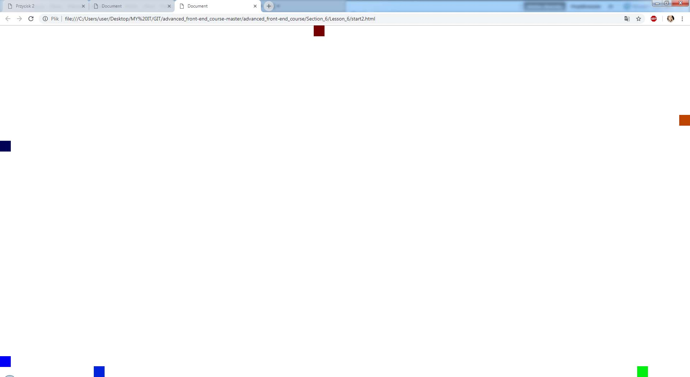      

* Three dots animation
* Three dots with span animation
* Banner with changing pictures

> Screenshot of "Changing banner"

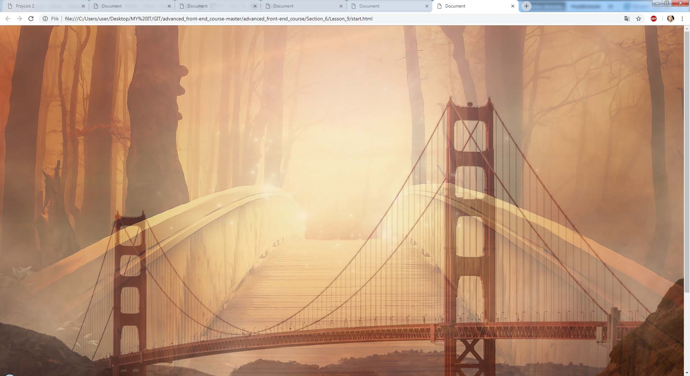      

> Screenshot of "Banner with text"

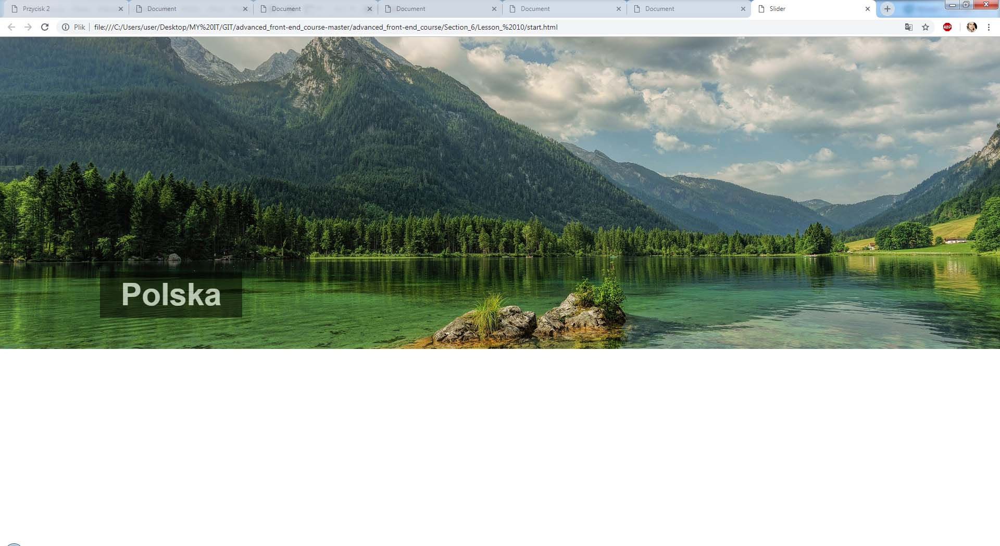      

- - -

**Section 7. Animation projects** :heavy_check_mark:

* Pong animation challenge

> Screenshot of "Pong"

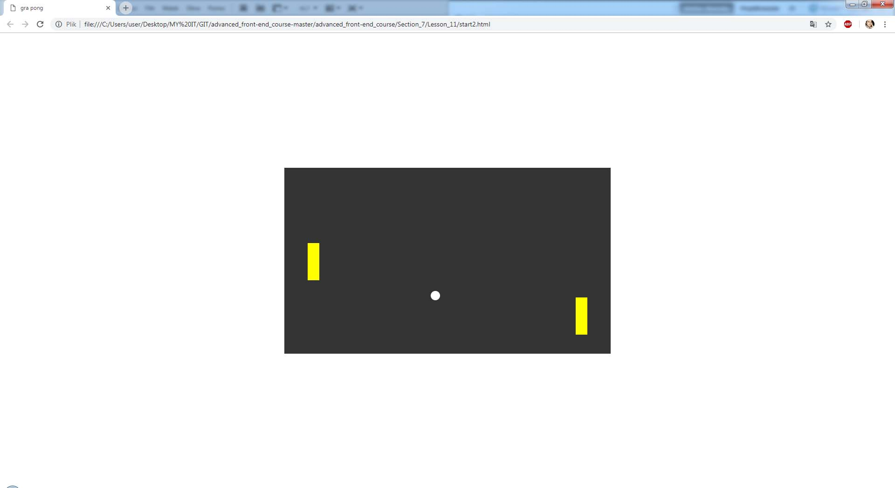      

* Walking man animation

> Screenshot of "Moving man"

      

* Bell animation

> Screenshot of "Bell"

      

* Arrow animation

- - -

**Section 8. Flexbox** :heavy_check_mark:

* Flexbox basics
* Flexbox properties
* Flexbox container
* Flexbox properties practice
* Flexbox model

- - -

**Section 9. Flexbox, CSS Grid and Responsive Web Design** :heavy_check_mark:

* Project calculator with Flexbox

> Screenshot of "Calc"

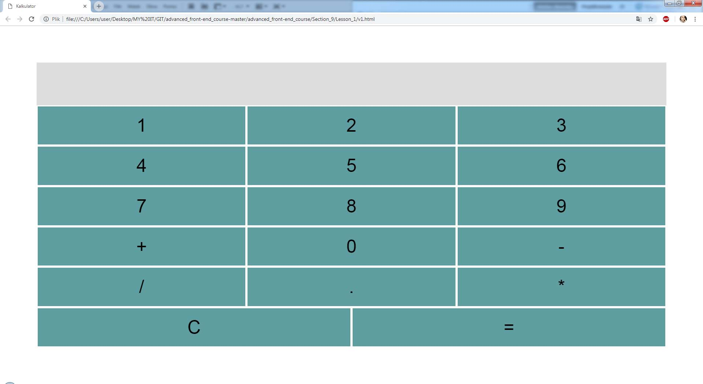      

* Project calculator with spaces beetween

> Screenshot of "Calculator"

      

* RWD with media queries

> Screenshot of "RWD"

      

* Galery with Flexbox

> Screenshot of "Galery"

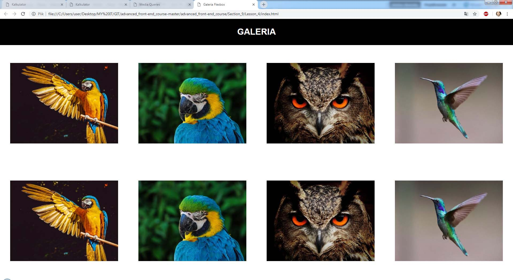      

* Flexbox layout
* Layout with flexbox and media queries

> Screenshot of "Flexbox layout"

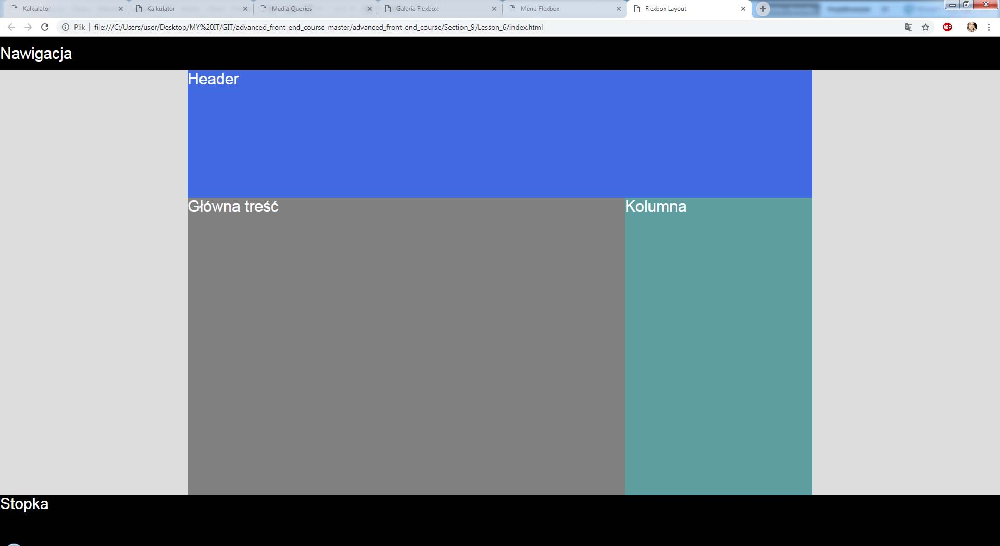      

* Layout with CSS Grid
* Pricelist with CSS Grid

> Screenshot of "Pricelist"

      

- - -

**Section 10. JavaScript in web design** :heavy_check_mark:

* JS basics
* Variables
* Types of variables
* JS events

- - -

**Section 11. JavaScript Projects** :heavy_check_mark:

* Working with JS
* Font size changing after click project
* Color change after clicking on div element project
* Rotating square
* Adding square after click project

- - -

**Section 12. jQuery basics** :heavy_check_mark:

* Adding square with button with JQ
* JQ basics
* Practicing JQ

> Screenshot of "Changing text style with buttons"

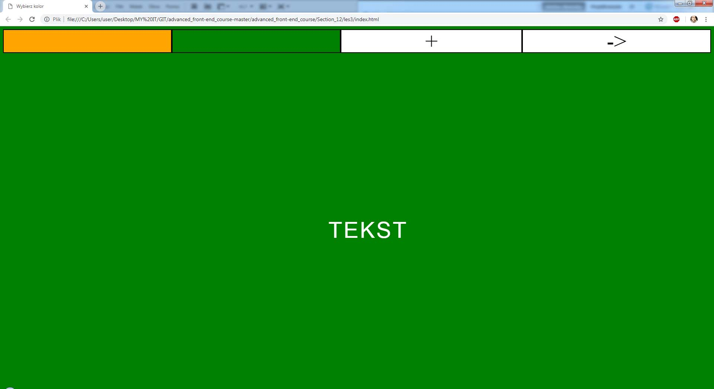      

* JQ properties and methods for DOM
* BG changing after button click

- - -

**Section 13. Burger menu** :heavy_check_mark:

* Project: Side burger menu with hover 
* Project: Sliding butger menu after click
* Project: Burger icon
* Project: Burger menu with JQ
* Project: Integration burger to webpage

> Screenshot of "Burger menu on webpage"

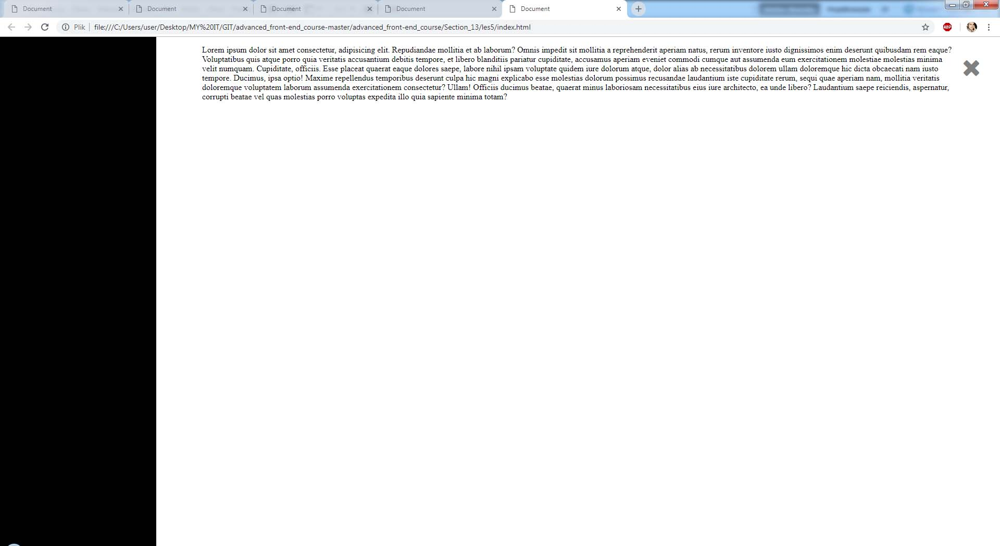      

* Project: Burger menu sliding from top
* Project: Burger menu at the bottom with JS

- - -

**Section 14. Popup (modal)** :heavy_check_mark:

*Project: Pop-up with JQ

> Screenshot of "Pop-up with JQ"

      

> Screenshot of "Pop-up after click"

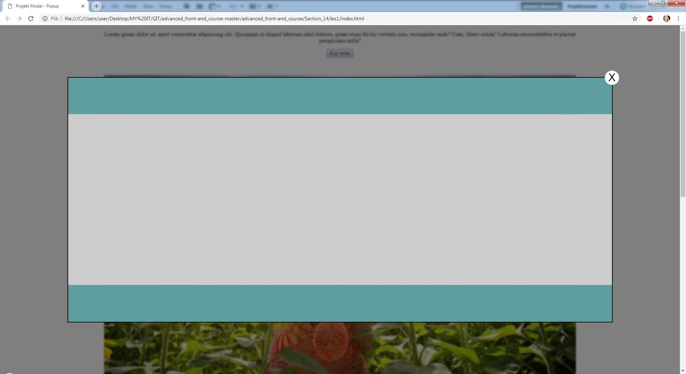      

*Project: Menu scrolling to some point with animation
*Project: Sidebar showing scroll position

> Screenshot of "Scroll position"

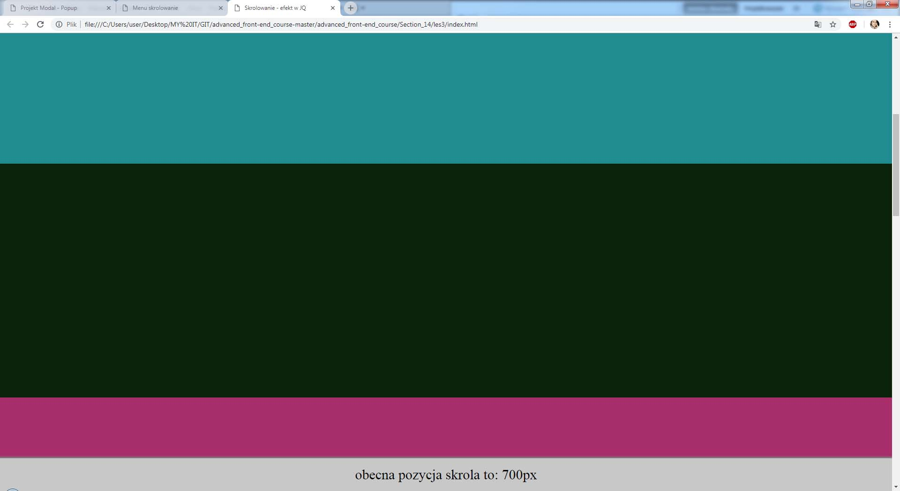      

*Project: Sidebar showing section and scroll position with JQ
*Project: Sidebar showing section and scroll position with JS
*Project: Showing elements with scrolling
*Project: Showing elements with JQ

> Screenshot of "Webpage animated with scroll position"

      

- - -

**Section 15. Slider (banner) and galery with JS, jQ and Flexbox** :heavy_check_mark:

*Project: Slider with animation HTML and CSS

> Screenshot of "Slider with animation"

      

*Project: Slider with animation JS

> Screenshot of "Slider with animation and JS"

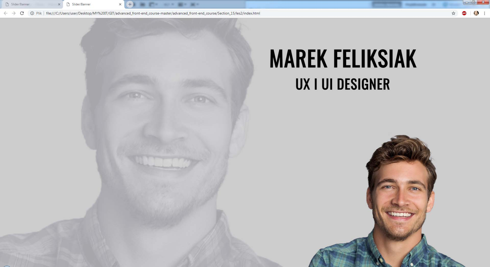      

*Project: Galery with pop-up

> Screenshot of "Pop-up galery"

      

*Project: Pop-up galery with Lightbox

> Screenshot of "Galery"

      

- - -

**Section 16. SASS basics** :heavy_check_mark:

* SASS basics

> Screenshot of "Webpage navigation"

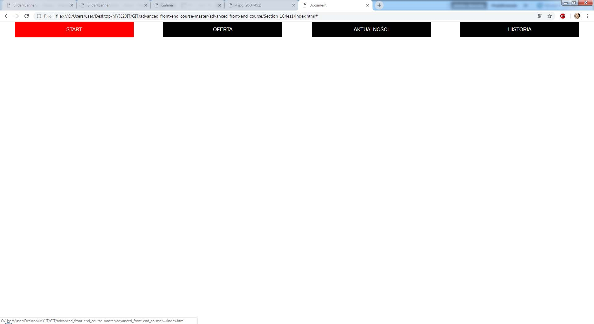      

* Practicing SASS
* Menu with SASS
* Menu with SCSS

- - -
